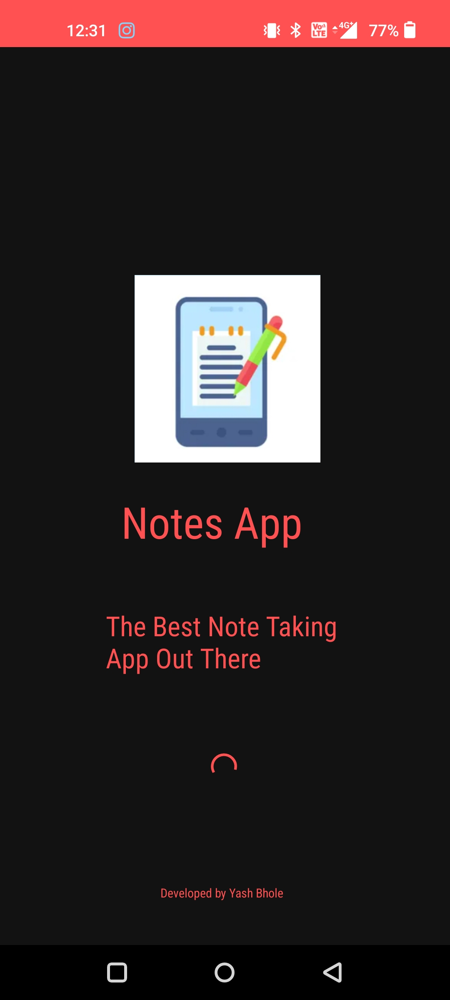
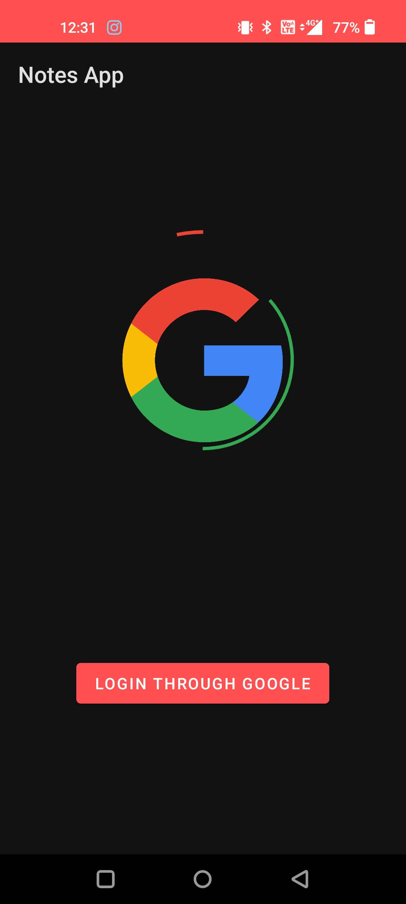
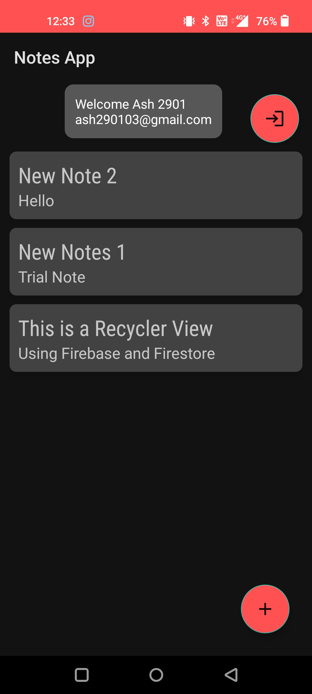
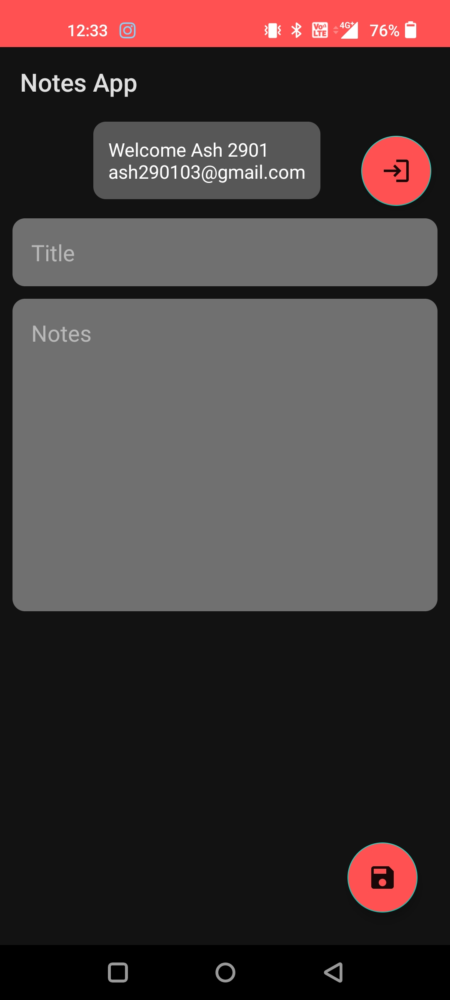

# Notes-App
## Devsoc Core Review

### This is Note Taking App using

-Google Aunthication

-Google Firestore to save and retrieve data

-Fragment Navigation 

-Recycler View

### Features:
*Google Authentication

*Use of Firestore

*Swipe Right on existing Notes to delete them

*Use of Splash Screen, App Logo and Lottie Animations.

### Challenges:
Coundn't add a edit notes Feature.

### Some Screenshots of the App:

### Splash Screen:

### Google Login Page:

### Saved Notes Page:

### New Notes Page:

